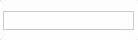
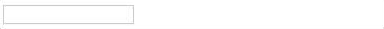

# RenaME

facilitador de vida quando se trata de nomes.
Formate nomes de forma fácil e eficiênte com essa lib 

### Prerequisites

Jquery >= 2.2.4

### Installing

Na tag HEAD adicione a lib rena.me.js após a declaração do JQuery
```html
<head>
    <script src="https://code.jquery.com/jquery-2.2.4.min.js" ></script>
    <script src="/rena.me.min.js"></script>
</head>
```

### Functions

##### - capitalize
```javascript
 var person_name = new RenaME('anderson hese')
 var complex_name = new RenaME('juquinha da silva lopes')
 person_name.capitalize().toString() // output > 'Anderson Hese'
 complex_name.capitalize().toString() // output > 'Juquinha da Silva Lopes'
```

##### - getCardLike
```javascript
 var person_name = new RenaME('juquinha da silva lopes')
 person_name.getCardLike().toString() // output > 'Juquinha S Lopes'
 person_name.getCardLike({dot: true}).toString() // output > 'Juquinha S. Lopes'
```

##### - getFirstName
```javascript
 var person_name = new RenaME('juquinha da silva lopes')
 person_name.getFirstName().toString() // output > 'juquinha'
 person_name.getFirstName().capitalize()toString() // output > 'Juquinha'
```

##### - getMiddleName
```javascript
 var person_name = new RenaME('juquinha da silva lopes')
 person_name.getMiddleName().toString() // output > 'silva'
 person_name.getMiddleName().capitalize()toString() // output > 'Silva'
```

##### - getLastName
```javascript
 var person_name = new RenaME('juquinha da silva lopes')
 person_name.getLastName().toString() // output > 'pereira'
 person_name.getLastName().capitalize()toString() // output > 'Lopes'
```

##### Input > Real-Time Capitalize

```html
<div>
  <input class="rena-me" data-rename-mask="getCardLike"></input>
  <script>
    var cntrl = new RenaME({input: $('.rena-me')});
  </script>
</div>
```

##### Input > Real-Time Label Capitalize

```html
<div>
  <input class="rena-me-with-label" data-rename-label=".rena-me-label"></input>
  <label class="rena-me-label" data-rename-mask="getCardLike"></label>
  <script>
    var cntrl = new RenaME({input: $('.rena-me-with-label')});
  </script>
</div>
```

## Authors

* **Anderson hese**  - [GITHub](https://github.com/andersonhese)

## License

This project is licensed under the MIT License - see the [LICENSE.md](LICENSE.md) file for details
